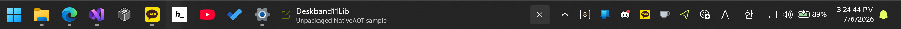

# Deskband11Lib

[](https://www.nuget.org/packages/Deskband11Lib.WinUI)
[](https://www.nuget.org/packages/Deskband11Lib.Wpf)
[](https://github.com/airtaxi/Deskband11Lib/actions/workflows/pack-and-publish.yml)
[](LICENSE)

🌐 [English](README.md) | 한국어

Deskband11Lib는 Windows 11 작업 표시줄 안에 UI 콘텐츠를 자연스럽게 배치할 수 있게 해주는 라이브러리입니다. 작은 대시보드, 빠른 제어 패널, 상태 표시기, 미디어 위젯, 런처, 생산성 도구처럼 항상 보여야 하는 기능을 데스크톱의 일부처럼 만들 수 있습니다.



## 패키지 구성

Deskband11Lib는 지원하는 UI 프레임워크별로 여러 NuGet 패키지를 제공합니다. `Deskband11Lib.Core`가 작업 표시줄 호스팅 엔진을 담당하며, 이후 Avalonia 같은 프레임워크도 facade 패키지로 추가 가능합니다.

| 패키지 | 설명 |
| --- | --- |
| `Deskband11Lib.Core` | 작업 표시줄 탐색, 레이아웃 계산, UI Automation 측정, Explorer 재시작 감지, Win32 HWND 호스팅 엔진입니다. UI 프레임워크와 독립적입니다. |
| `Deskband11Lib.WinUI` | WinUI 3 facade입니다. WinUI 컨트롤, 스타일, composition 기능을 그대로 활용해 작업 표시줄 위젯을 만들 수 있습니다. |
| `Deskband11Lib.Wpf` | WPF facade입니다. WPF 기반 콘텐츠를 동일한 API로 Windows 11 작업 표시줄에 배치할 수 있습니다. |

## 주요 기능

- 앱에서 쓰는 프레임워크 고유의 컨트롤과 스타일 그대로 작업 표시줄 위젯을 만들 수 있습니다.
- 전체 창을 열지 않아도 사용자가 바로 확인할 수 있는 위치에 실시간 정보를 보여줄 수 있습니다.
- 타이머, 미디어 재생, 계정 전환, 빌드 상태, 장치 모니터링, 빠른 실행 같은 기능을 작고 밀도 있게 배치할 수 있습니다.
- 고정된 앱, 실행 중인 앱, 알림 영역과 겹치지 않도록 사용 가능한 작업 표시줄 공간에 맞춰 콘텐츠를 배치합니다.
- 부드러운 레이아웃 애니메이션을 위한 내장 easing 함수를 제공합니다 (Linear, Sine, Quadratic, Cubic, Quartic, Quintic, Exponential, Circle).
- Explorer가 재시작되어도 애플리케이션이 호스팅 창을 안전하게 다시 만들 수 있도록 알려줍니다.
- WinUI facade는 Windows App SDK 앱과 NativeAOT 게시를 지원합니다.

## 설치

사용 중인 UI 프레임워크에 맞는 패키지를 선택하세요.

```powershell
# WinUI 3
dotnet add package Deskband11Lib.WinUI

# WPF
dotnet add package Deskband11Lib.Wpf
```

`Deskband11Lib.Core` 패키지는 전이 의존성으로 자동 포함됩니다.

## 기본 사용법

### WinUI 3

WinUI 창을 만들고 `TaskbarContentHost`를 생성한 다음, 초기 작업 표시줄 레이아웃 준비가 끝난 뒤 attach하고 창을 활성화합니다.

```csharp
using Deskband11Lib.Core;
using Deskband11Lib.WinUI;

var window = new MainWindow();
var host = new TaskbarContentHost(window, rootElement, new TaskbarContentHostOptions
{
    PreferredWidth = 360,
    PreferredHeight = 48,
    AnimateLayoutChanges = true,
    LayoutAnimationDuration = 500,
    LayoutAnimationEasing = EasingFunctions.CircleOut
});

await host.AttachWhenLayoutReadyAsync();
window.Activate();
```

### WPF

WPF에서도 동일한 API를 사용합니다. `Window`와 `FrameworkElement` 타입이 WPF 전용인 점만 다릅니다.

```csharp
using Deskband11Lib.Core;
using Deskband11Lib.Wpf;

var window = new MainWindow();
var host = new TaskbarContentHost(window, rootElement, new TaskbarContentHostOptions
{
    PreferredWidth = 360,
    PreferredHeight = 48
});

await host.AttachWhenLayoutReadyAsync();
window.Show();
```

### Explorer 재시작

Explorer가 재시작되면 작업 표시줄이 기존 자식 창을 파괴합니다. `TaskbarWindowRecreated` 이벤트를 처리해 창을 다시 만드세요.

```csharp
host.TaskbarWindowRecreated += async (_, _) =>
{
    await RecreateMainWindowAsync();
};
```

## 동작 방식

Deskband11Lib는 앱에 작업 표시줄 크기의 표시 영역을 제공하고, 실제 작업 표시줄 레이아웃에 맞춰 그 영역을 계속 정렬합니다. 내부적으로는 일반적인 Win32 창 부모 관계를 이용합니다.

- 기본 작업 표시줄 창인 `Shell_TrayWnd`를 찾습니다.
- 애플리케이션이 만든 일반 프레임워크 `Window`를 받습니다.
- 창 스타일을 최상위 popup 창에서 자식 창 스타일로 바꿉니다.
- `SetParent`로 창을 작업 표시줄 아래에 붙입니다.
- 작업 표시줄 버튼과 알림 영역 사이에서 사용할 수 있는 사각형을 계산합니다.
- `SetWindowPos`와 `SetWindowRgn`으로 호스팅된 창의 위치와 클리핑 영역을 조정합니다.

현재 Windows 11에서는 작업 표시줄의 자식 HWND 계층만으로 실제 작업 표시줄 버튼 폭을 안정적으로 얻기 어렵습니다. 그래서 Deskband11Lib는 UI Automation으로 작업 표시줄에 보이는 버튼들의 위치를 확인합니다. UI Automation 스캔은 UI thread 밖에서 실행되고 캐시되므로, 레이아웃 갱신이 호스팅된 콘텐츠를 막지 않습니다.

## 옵션

모든 옵션은 `Deskband11Lib.Core.TaskbarContentHostOptions`에 정의되어 있으며 모든 facade에서 공유됩니다.

| 옵션 | 기본값 | 설명 |
| --- | --- | --- |
| `PreferredWidth` | `360` | 콘텐츠가 원하는 너비입니다. effective pixel 단위입니다. |
| `PreferredHeight` | `48` | 콘텐츠가 원하는 높이입니다. effective pixel 단위입니다. |
| `AnimateLayoutChanges` | `true` | 작업 표시줄 호스트의 위치와 크기 변경을 애니메이션합니다. |
| `LayoutAnimationDuration` | `500` | 레이아웃 애니메이션 시간입니다. ms 단위입니다. |
| `LayoutAnimationEasing` | `EasingFunctions.CircleOut` | 레이아웃 애니메이션에 사용할 easing delegate(`Func<double, double>`)입니다. 오버슛 없는 내장 easing은 `Deskband11Lib.Core.EasingFunctions`에서 제공합니다. |
| `StartAreaWidth` | `60` | 시작 버튼 영역으로 예약할 너비입니다. |
| `Placement` | `BeforeNotificationArea` | 알림 영역 앞 또는 작업 표시줄 버튼 뒤쪽 중 배치 위치를 선택합니다. |
| `TrackTaskbarButtons` | `true` | UI Automation 기반 작업 표시줄 버튼 측정을 사용할지 정합니다. |
| `TrackNotificationArea` | `true` | 콘텐츠가 알림 영역을 침범하지 않도록 합니다. |
| `LayoutRefreshInterval` | `500 ms` | 작업 표시줄 레이아웃을 다시 확인하는 주기입니다. |

## 내장 Easing 함수

`Deskband11Lib.Core.EasingFunctions`는 `LayoutAnimationEasing`에 사용할 수 있는 다음 easing 함수를 제공합니다.

- `EasingFunctions.Linear`
- `EasingFunctions.SineIn` / `SineOut` / `SineInOut`
- `EasingFunctions.QuadraticIn` / `QuadraticOut` / `QuadraticInOut`
- `EasingFunctions.CubicIn` / `CubicOut` / `CubicInOut`
- `EasingFunctions.QuarticIn` / `QuarticOut` / `QuarticInOut`
- `EasingFunctions.QuinticIn` / `QuinticOut` / `QuinticInOut`
- `EasingFunctions.ExponentialIn` / `ExponentialOut` / `ExponentialInOut`
- `EasingFunctions.CircleIn` / `CircleOut` / `CircleInOut`

직접 작성한 `Func<double, double>` delegate를 전달할 수도 있습니다.

## 샘플 프로젝트

위의 코드 조각은 핵심 API 형태를 보여주기 위한 최소 예제입니다. 실제 작업 표시줄 companion 앱을 만들 때는 창 수명주기, 시작 순서, Explorer 재시작 복구, 프레임워크별 호스팅 세부 처리가 중요하므로 샘플 프로젝트를 먼저 참고하는 것을 권장합니다.

- `Deskband11Lib.WinUI.Sample`: WinUI 3 및 Windows App SDK 앱용 샘플입니다.
- `Deskband11Lib.Wpf.Sample`: WPF 앱용 샘플이며, 투명한 borderless host 창 설정을 포함합니다.

## 요구 사항

- Windows 11.
- 선택한 UI 프레임워크와 호환되는 target framework.
- WinUI 3는 Windows App SDK가 필요합니다.
- WPF는 프로젝트 파일에 `UseWPF=true`가 필요합니다.

## 프로젝트 개발

```powershell
dotnet restore
dotnet build Deskband11Lib.slnx -c Debug
dotnet publish Deskband11Lib.WinUI.Sample\Deskband11Lib.WinUI.Sample.csproj -c Release -r win-x64
```

## 감사의 말

[zadjii](https://github.com/zadjii)와 [Deskband11](https://github.com/zadjii/Deskband11)에 감사드립니다. Windows 11 작업 표시줄 안에 애플리케이션 콘텐츠를 가져온다는 핵심 아이디어는 해당 프로젝트에서 비롯되었으며, Deskband11Lib는 그 놀라운 발상에서 큰 영감을 받았습니다.

## 라이선스

Deskband11Lib는 [MIT License](LICENSE)로 배포됩니다.

## 작성자

[Howon Lee (airtaxi)](https://github.com/airtaxi)가 만들었습니다.
